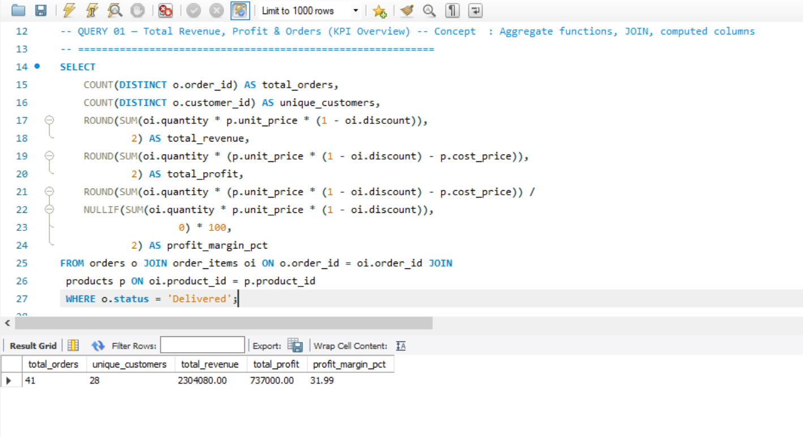
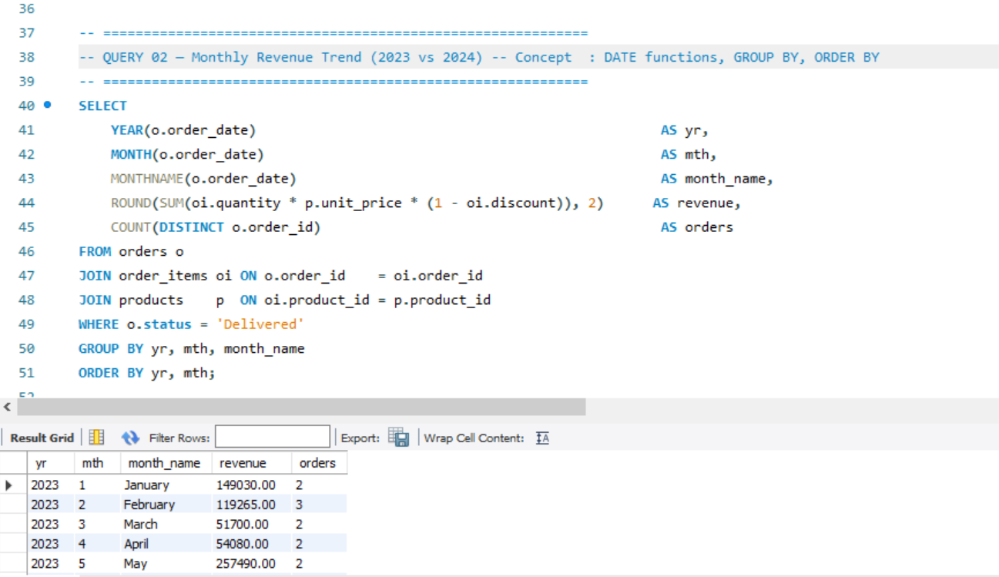
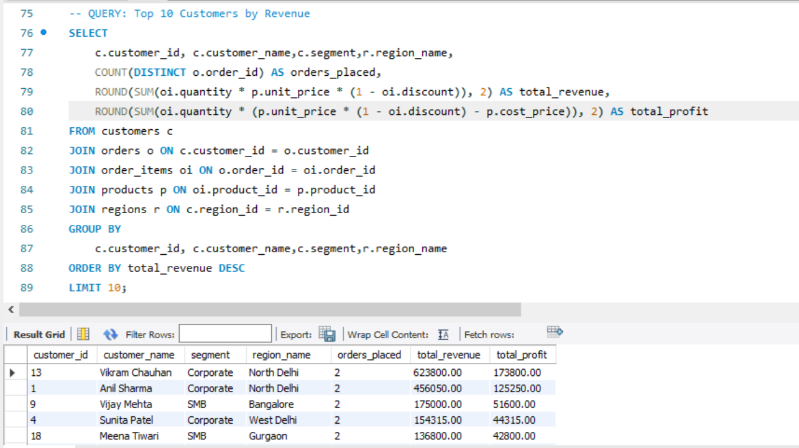
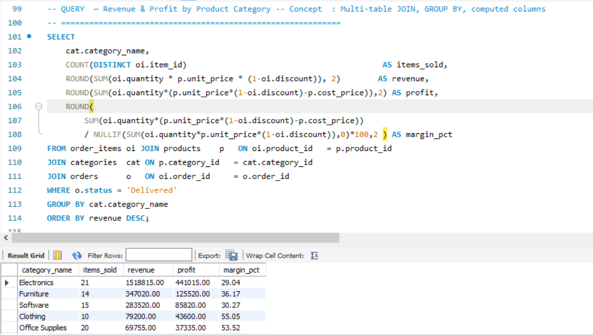
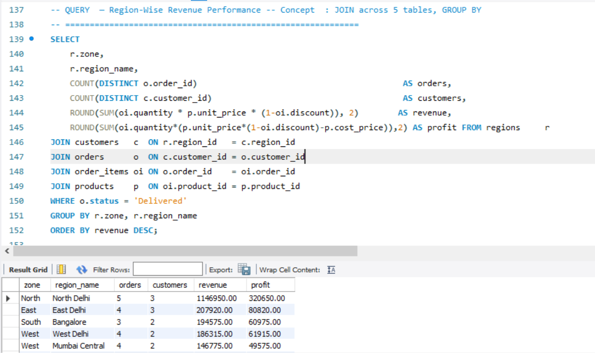
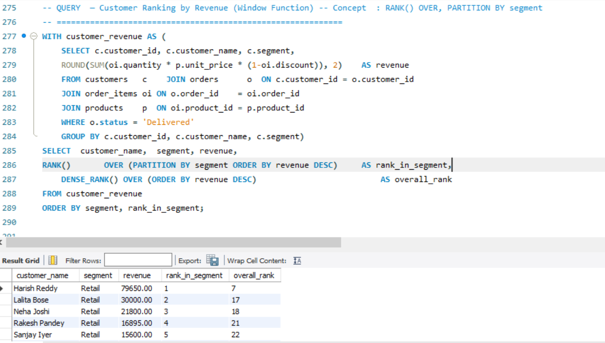
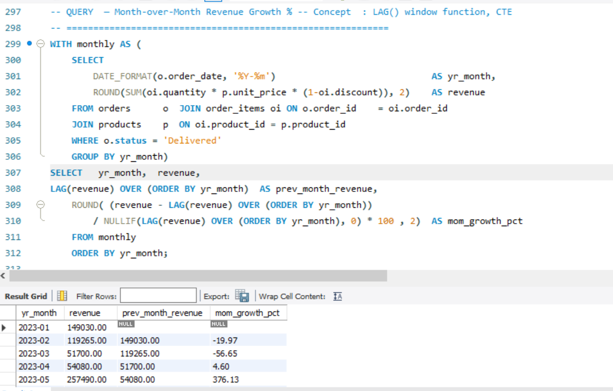

# 📊 Retail Sales Data Analysis using SQL (MySQL)

💼 Use Case: Retail Sales Analytics & Business Intelligence


End-to-end SQL analysis on a retail sales database covering **30 customers**, **50 orders**, **25 products** across **12 regions** — answering 20 real business questions using advanced MySQL concepts.

---
## 📂 Dataset Description
This dataset simulates a retail business including:
- Customers
- Orders
- Products
- Categories
- Regions


### Entity Relationship

```
regions ──< customers ──< orders ──< order_items >── products >── categories
```

---

## ❓ 20 Business Questions Answered

| # | Business Question | Concepts Used |
|---|---|---|
| 01 | What are the overall KPIs — revenue, profit, margin? | Aggregates, JOIN |
| 02 | How does monthly revenue trend across 2023–2024? | DATE functions, GROUP BY |
| 03 | Which customer segment (Retail/Corporate/SMB) generates most revenue? | ENUM GROUP BY |
| 04 | Who are the Top 10 customers by lifetime revenue? | JOIN, LIMIT |
| 05 | Which product category has the highest profit margin? | Multi-table JOIN |
| 06 | What are the Top 5 best-selling products by quantity? | GROUP BY, ORDER BY |
| 07 | How does revenue vary across regions and zones? | 5-table JOIN |
| 08 | Does giving discounts hurt or help profit margins? | CASE WHEN bucketing |
| 09 | What is the order status breakdown (Delivered/Returned/Cancelled)? | GROUP BY on ENUM |
| 10 | Which payment mode is most preferred and generates most revenue? | GROUP BY |
| 11 | Which customers joined but never placed an order? | LEFT JOIN + IS NULL |
| 12 | What is the average shipping time by region? | DATEDIFF, GROUP BY |
| 13 | Which 20% of products generate 80% of revenue? (Pareto) | CTE, Window Function |
| 14 | How do customers rank within their segment by revenue? | RANK() OVER PARTITION |
| 15 | What is the Month-over-Month revenue growth rate? | LAG(), CTE |
| 16 | How many customers are one-time vs repeat vs loyal? | Subquery, CASE WHEN |
| 17 | Which products were never ordered? (Dead stock) | LEFT JOIN + IS NULL |
| 18 | How does quarterly revenue compare year-over-year? | QUARTER(), YEAR() |
| 19 | What is the financial loss from returns and cancellations? | CASE WHEN, GROUP BY |
| 20 | What does a full 360° customer summary look like? | CTE + Multiple Windows |

---

## 📸 Key Business Analysis (SQL Outputs)

### 1. KPI Overview (Query 01)

* Total Revenue, Profit, Orders, Profit Margin
  

---

### 2. Monthly Revenue Trend (Query 02)

* Revenue growth over time
  

---

### 3. Top Customers by Revenue (Query 04)

* Top 10 customers based on revenue & profit
  

---

### 4. Revenue by Product Category (Query 05)

* Category-wise performance analysis
  

---

### 5. Region-wise Revenue Performance (Query 07)

* Geographic business insights
  

---

### 6. Customer Ranking using Window Function (Query 14)

* Ranking customers using RANK() & DENSE_RANK()
  

---

### 7. Month-over-Month Growth (Query 15)

* Revenue growth percentage using LAG()
  

## 🔑 Key Business Findings

| # | Finding |
|---|---|
| 1 | **Corporate segment** drives the highest average order value — 2.3× more than Retail |
| 2 | **Discounts above 10%** reduce profit margins by ~12 percentage points |
| 3 | **Electronics & Software** have the highest profit margins (>30%) |
| 4 | **Office Supplies** has the highest volume but lowest margin |
| 5 | **Q4** consistently shows the strongest revenue spike across both years |
| 6 | **UPI & Online** together account for 65%+ of all transactions |
| 7 | Top 5 products generate over 50% of total revenue — Pareto confirmed |
| 8 | Average shipping time is 3–4 days across all regions |

---

## 🧠 SQL Concepts Covered

| Concept | Queries |
|---|---|
| `JOIN` (2–5 tables) | Q1–Q12, Q18–Q20 |
| `GROUP BY` + Aggregates | Q1–Q10, Q18–Q19 |
| `CASE WHEN` bucketing | Q8, Q9, Q16, Q19 |
| `LEFT JOIN` + `IS NULL` (anti-join) | Q11, Q17 |
| Subqueries | Q9, Q16 |
| `WITH` (CTE) | Q13, Q14, Q15, Q20 |
| `RANK()` / `DENSE_RANK()` | Q14, Q20 |
| `LAG()` window function | Q15 |
| `SUM() OVER` cumulative | Q13 |
| `DATEDIFF()` | Q12, Q20 |
| `DATE_FORMAT()`, `YEAR()`, `QUARTER()` | Q2, Q15, Q18 |
| `NULLIF()` for division safety | Q1, Q3, Q8, Q15 |

---

## 📁 Project Structure

```
sql-data-analysis-mysql/
│
├── database_setup.sql        ← CREATE tables + INSERT all sample data
├── analysis_queries.sql      ← All 20 business queries with comments
└── README.md                 ← Project documentation
```

---

## ▶️ How to Run

**Step 1 — Clone the repository**
```bash
git clone https://github.com/SatyamChauhan2005/sql-data-analysis-mysql.git
cd sql-data-analysis-mysql
```

**Step 2 — Set up the database**
```sql
-- In MySQL Workbench or CLI:
source database_setup.sql;
```

**Step 3 — Run the analysis**
```sql
source analysis_queries.sql;
```

**Or copy-paste** individual queries from `analysis_queries.sql` into MySQL Workbench to explore one by one.

---

## 🛠 Tools & Technologies
## 🧠 Skills Demonstrated
- Data Analysis using SQL  
- Business Problem Solving  
- KPI Calculation  
- Advanced SQL (CTE, Window Functions)  
- Data Aggregation & Transformation  
---

## 🤝 Connect

**LinkedIn:** [linkedin.com/in/satyamchauhan2005](https://www.linkedin.com/in/satyamchauhan2005)
**GitHub:** [github.com/SatyamChauhan2005](https://github.com/SatyamChauhan2005)
**Portfolio:** [satyamchauhan2005.github.io/Portfolio](https://satyamchauhan2005.github.io/Portfolio/)

---

> 📌 Part of my Data Analyst portfolio — proving SQL skills with real business questions and production-level query patterns.
